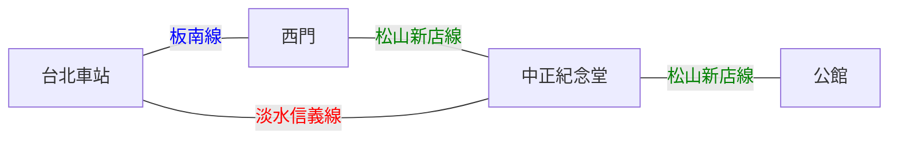

# 交通篇

## 平日生活

還是雙腳、UBike、捷運為大宗，太有錢或是遠離捷運的地方坐Uber、Yoxi，上來之前可以先弄好WeMO、GoShare、iRent帳號的設定，平常喜歡亂跑的有機車也可以寄上來，記得要申請全區車位。

## 來台科

基本上是坐**火車**、**高鐵**、**客運**到**台北車站**，我自己是覺得貼個幾百可以舒舒服服的坐高鐵，Why not? (高鐵可以看大學生票，有打折) (高鐵可以用 T-EX行動購票 )


【經驗分享】 去年國慶返家，我比我北科朋友晚1小時上車(我搭高鐵、他搭客運)，結果我已經吃完消夜回到家了，他才剛下高速公路。


然後可以坐捷運

* 路線一：北車<mark style="color:blue;">**板南線**</mark>到西門轉<mark style="color:green;">**松山新店線**</mark>到公館
* 路線二：北車<mark style="color:red;">**淡水信義線**</mark>到中正紀念堂轉<mark style="color:green;">**松山新店線**</mark>到公館
* 公館站從**二號出口**出來旁邊就是**台大舟山路校門**了

出公館站後的路可以走路或UBike(通常會走台大裡面)

<figure><figcaption></figcaption></figure>




【也可以參考Uber】



## YouBike

* 二宿後面有站點
* 騎到公館站只要5塊錢
* 可以下載youbike2.0 APP查看！
* (**記得先登入悠遊卡號哦**)

## 台科停車位

* 唯一建議，申請全區停車
* 才600元/學期(不香嗎?)
