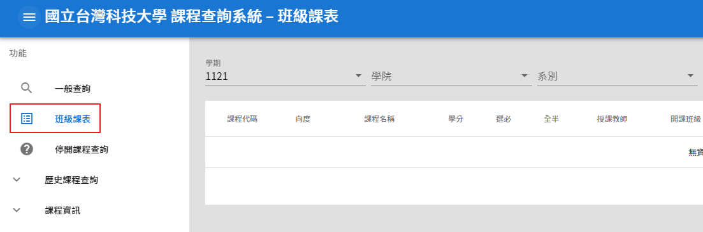

# 📖 選課篇

## 各前言

選課系統畢竟是給所有人用的，所以不會太難。

選哪些課請自己去[GPA網站](https://gpa.ntustexam.com/)或是Dcard等查詢哪些課比較涼，通識課的主要目的除了學習內容之外是洗GPA跟認識新同學。

如果想查詢其他人對課程的評價，可以到[CrossLink](https://www.crosslink.tw)上面查詢，挑個涼課，大學爽爽過。


大一記得都要選體育課跟國文課。


### 國文課

* 上學期修A，下學期就修B，反之亦然
* A區四選一修即可

### 體育課

體育有**各系各年級**的時間分配表，在課程查詢系統中可以下載

* 大一體育通常是在第9、10節
* 只能選你們班有開的體育
* **絕對不會跟系必修撞課！**


**【沒選到喜歡的/沒選到 體育課or國文課怎麼辦】**

> 教你一招，**騎驢找馬**！ :horse: :horse:

先不要急著退選已經選到的課(沒選到的先去選一門還沒滿的課)，先去問想上的那門課的老師願不願意讓你加簽

* 如果老師願意給加簽，那再來把原本那門課退掉
* 如果老師不願意給，那至少你還有一門課可以上


### 英文課

* 初階中階模組的必修課學校會幫你排好老師，不用選課(會直接出現在必修選課表上面)
* 若是沒有申請免考分級會考，也沒有考分級會考的話將無法分級，就無法修任何一門英文課
* 其他多元必修只能選擇同模組，或是更高等級模組的課
* 不同模組請參考

<figure><figcaption></figcaption></figure>

<figure><figcaption></figcaption></figure>

<figure><figcaption>
各英檢的對應英文等級等級
</figcaption></figure>

### 通識課

* 共有六個向度

## 學分限制

* 選課學分限制16\~25/學期
* 每學期最低必須選到16學分 (但沒選到好像也只是不排名而已)
* 最高可選到25學分，如果前一學期gpa有達標(大概是3.38)，最多可超修至31學分 (在全校加退選階段才可以超修)
* **初選階段(含搶課)，通識課程最只能選三門**，全校加退選階段就不限


雖然學校沒硬性規定一定要修到16學分，但如果**沒修到最低學分，會不排班排**，這會影響到你之後推碩班，而且如果你前面學分修太少，後面幾個學期會補學分補得很辛苦！

**建議每學期選18\~22個學分**，就可以涼涼過了。


## 選課系統

* 選課期間，系統上的人數會是顯示將這門課加入志願序的人數，可以利用這個來調整你的志願序
* **同課名、同時間的課就是要你選老師**
* 有些通識課在初選(填志願階段)有**班級限制**，你可以先找到你們班級優先選的課，這樣一定會抽到通識課
* 通識課在整個初選階段，**上限3門**，但在全校加退選時就沒有這個限制了
* 如果課程查詢系統中，**選課總人數和備註欄裡面的上限人數相同**，代表那門課已經被選滿了，就不用再把他加進去志願序了
* [選課系統操作手冊](https://www.academic.ntust.edu.tw/var/file/48/1048/img/2563/627618988.pdf)

### 志願序抽選

* 蠻複雜的大致重點只有幾個
  * 課程中簽後，系統會自動把在志願序中同課名和撞時間的其他課ban掉
  * 所以填越多越好(上限好像是30個志願的樣子)
  * 體育和國文千萬不要只填一門課(很容易沒抽到)
* [志願序抽選規則](https://www.academic.ntust.edu.tw/var/file/48/1048/img/2563/544158721.ppsx)
  * 有點複雜，但如果看懂他是如何抽選的還蠻有用的

## 初選階段

* 比運氣環節。
* 填志願用抽的，基本上較熱門的課不放第一是不會上的，就是可以多填一些，選到不喜歡的可以之後再退。

### 初選流程

**【台科的選課模式】**

* 初選前三天會讓你到選課系統排志願表，之後會系統暫停選課1\~2天進行**志願序抽選**
* 抽選完之後會讓你有一天的時間去看自己選到了哪些課，這時候就要去課程查詢系統看有哪些課是還沒被選滿的(或是在只能用加選的)
* 之後會有2\~3天的時間，這時候的課就先搶先贏了

## 加退選

* 用肝換課環節。
* 線上加退選課，名額先搶先贏，基本上好的課都會維持滿的，要靠人品在別人退課的時候加選到，這個階段基本上有付出不一定有收穫，但我之前就在這裡搶到一堆熱門課。
* 這段時間很長，基本上會一直到開學前兩週，可以去上看看再決定要不要把課退掉。

## 加簽

* 俗稱跪教授環節。
* 開學前兩週可以找教授加簽課程，可以先寄信詢問教授是如何給授權碼的，通常會要你去該堂課程的第一次上課，可以再查課的地方查時間地點。
* 有些教授會有加簽的規定，諸如大四以上優先、加簽前要先交心得...etc
* 我已知不給加簽的熱門課：
  * 藥物與健康(王教授)：教授說他已經開到最大班了，所以沒辦法給加簽

### 授權碼

* 一個很神奇的東西，當你跪完教授，如果教授開心就會給你的一串神奇小文字
* 白話文：你有課上了啦
* 到選課系統中輸入授權碼，這門課就會直接跑進你的課表了


領授權碼時，教授會要你**簽名**，這張授權碼就是給簽名名字的那個人，**不能轉讓給其他人**。 如果被發現授權碼被轉讓，教授**有權直接把你退選**！


## 台大系統選課

* 台大系統選課初選階段**沒有開放新生選課**
* 新生只能在全校加退選階段進行台大系統的選課！

## 其他資料

* [選課須知與時程](https://www.academic.ntust.edu.tw/p/412-1048-8580.php?Lang=zh-tw)：查詢每學期選課事務相關的時程
* [跨校選課看這邊](https://www.dcard.tw/f/ntust/p/239235745)
* [**各系畢業所需學分**](https://www.academic.ntust.edu.tw/var/file/48/1048/img/2570/909564337.pdf)

## 小撇步

通常在抽選的最後一天下午，就可以透過一些方法來看有沒有選到課了。

* **第一種方法**：課程查詢系統中，先把待選清單(你有填入志願表的課)記下來，然後清空，接著一個個去按你填入志願表之課程後面的+號，如果系統顯示 **"無法加入待選清單"、"這門課你正在修習中"**，那8成就是有選到了
* **第二種方法**：去看[Moodle](https://moodle2.ntust.edu.tw)中**有沒有出現課程**，9成以上就可以確定有選上
